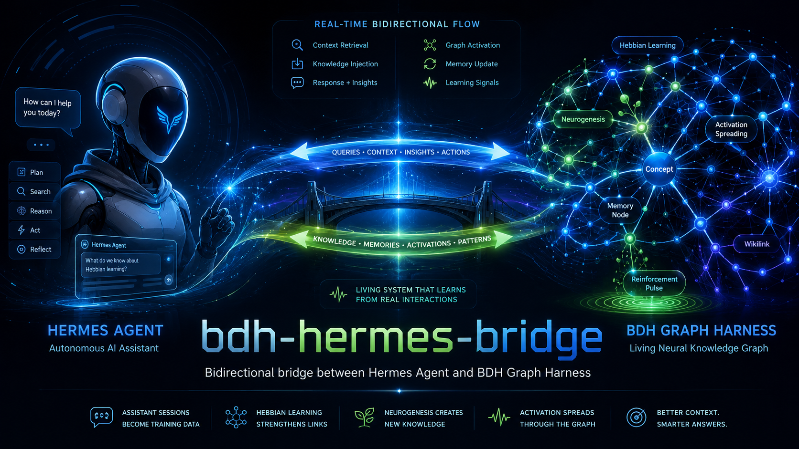

<p align="center">
  
</p>

# bdh-hermes-bridge

Bidirectional plugin bridge between [Hermes Agent](https://github.com/NousResearch/hermes-agent) and [BDH Graph Harness](https://github.com/albidev/bdh-graph-harness).

The plugin connects Hermes' real conversations to BDH's neural knowledge graph and exposes BDH context as native Hermes tools. It learns from actual usage — not fabricated bridge queries.

> **Status:** standalone Hermes plugin, version **0.4.0**.

## What it does

### Automatic read path — BDH → Hermes

At `pre_llm_call`, the bridge captures the original user message and applies a conservative eligibility gate. It automatically retrieves context only for substantive technical or episodic messages — for example debugging, architecture, configuration, project questions, or references to earlier decisions. Casual messages such as “ciao”, “grazie”, and “ok” are skipped.

Automatic retrieval sends:

```json
{
  "query": "the original user message",
  "source": "automatic_retrieval",
  "learn": false,
  "respond": false
}
```

`learn: false` makes this a read-only retrieval: no Hebbian reinforcement and no neurogenesis. The result is returned from `pre_llm_call` as ephemeral context injected into the current user message:

```text
[BDH CONTEXT — optional]
Activated neurons:
- ...

Relevant graph synthesis:
...

Use this as supporting context.
Do not mention BDH unless relevant.
If it conflicts with the current conversation, prefer the current conversation.
[/BDH CONTEXT]
```

The original user message remains the primary signal. BDH context supports it; it never replaces it. If BDH is unavailable, the hook returns no context and Hermes continues with its normal prompt after a short bounded timeout.

Automatic retrieval uses the vault's Hybrid index: Chroma cosine KNN plus BM25 lexical scoring. BDH exposes raw routing metadata (`vector_top_score`, `bm25_top_score`, `bm25_matched_terms`, `hybrid_top_score`, and `hybrid_margin`) before graph expansion. The bridge injects context when there are at least two lexical term matches or a strong semantic vector score. This is experimental routing logic; it does not modify Hebbian state.

### Automatic write path — Hermes → BDH

The plugin registers `pre_llm_call` to capture the current user message and `post_api_request` to inspect each API response. Only a substantial final response is sent back to BDH:

- `finish_reason == "stop"`
- assistant content is at least **200 characters**
- assistant content is non-empty
- a user message was captured by `pre_llm_call`

The request is sent in a daemon thread, so BDH learning does not block the agent response.

Payload:

```json
{
  "query": "the original user message",
  "user_prompt": "the assistant response",
  "source": "assistant_response"
}
```

The user message is deliberately used as the embedding/retrieval seed. The assistant response is supplied as context for BDH's LLM and neurogenesis stages. This avoids embedding Hermes' own answer as the primary signal and reduces feedback amplification.

When `source` is `assistant_response`, BDH applies dampened Hebbian learning (`frequency += 0.3` instead of the normal `1.0`). Neurogenesis still runs when BDH identifies a genuinely new concept.

### On-demand read path — BDH → Hermes

The plugin also registers two tools in the `bdh` toolset:

| Tool | Purpose |
|---|---|
| `bdh_query` | Perform a deeper, intentional graph query during reasoning. Uses normal Hebbian learning (`frequency += 1.0`). |
| `bdh_stats` | Return current graph metrics without querying the graph or triggering learning. |

Automatic retrieval provides lightweight initial context; `bdh_query` remains available when the model needs a targeted follow-up.

Example tool input:

```json
{
  "query": "How did we recover the Hermes session database?"
}
```

The tool returns a compact JSON result containing:

- up to 10 activated notes with scores
- BDH's generated response
- newly created concepts
- Hebbian update count
- neuron and synapse counts

## Echo-loop prevention

Without safeguards, a graph-backed agent can create this loop:

```text
BDH context → Hermes response → BDH indexes the response → same context is reinforced
```

This plugin prevents that in three ways:

1. The original user message is the primary `query`/embedding seed.
2. The assistant response is passed separately as `user_prompt`.
3. Assistant-originated writes use `source: "assistant_response"`, enabling dampened Hebbian updates on the server.

If no user message was captured, the write is skipped entirely. Embedding an orphaned assistant response would be exactly the sort of clever nonsense that makes a graph worse.

## Resilience and timeouts

BDH requests are made through a small HTTP helper with configurable base URL and bounded timeouts.

| Path | Timeout | Attempts | Timeout retry |
|---|---:|---:|---|
| Automatic write hook | 30s | 2 total | No |
| `bdh_query` tool | 30s | 2 total | No |
| `bdh_stats` tool | 5s | 1 | N/A |

The POST `/api/query` endpoint is non-idempotent: BDH may have processed a request even if the client timed out. Therefore timeout errors are not retried, preventing duplicate Hebbian updates and duplicate neurogenesis.

If BDH is unreachable:

- the automatic hook logs a warning and Hermes continues normally;
- `bdh_query` returns an actionable JSON error telling Hermes to answer from internal knowledge;
- `bdh_stats` returns a JSON error instead of crashing the agent loop.

Other transient request failures can use the bounded retry path with exponential backoff. The current implementation is intentionally short and conservative rather than retrying for minutes while the agent waits.

## Architecture

```text
User message
     │
     ▼
pre_llm_call
     │ captures user_message
     ▼
Hermes LLM ────────────────┐
     │                     │ may call bdh_query
     │ final response      │ source: hermes_tool
     ▼                     │
post_api_request           │
     │                     │
     │ if stop + >200 chars│
     │ source: assistant_response
     ▼                     │
BDH /api/query ◄───────────┘
     │
     ├── retrieval / activation
     ├── dampened Hebbian update
     ├── quality propagation
     └── neurogenesis when justified
```

## Requirements

- Hermes Agent with plugin support
- Hermes running in a gateway-managed/plugin-enabled process
- BDH Graph Harness running and exposing its HTTP API
- Default BDH endpoint: `http://localhost:8643`

The endpoint can be overridden with:

```bash
export BDH_API_URL="http://127.0.0.1:8643"
```

## Installation

### Clone into the Hermes plugin directory

```bash
git clone https://github.com/albidev/bdh-hermes-bridge.git ~/.hermes/plugins/bdh-hermes-bridge
```

### Or use a development symlink

```bash
git clone https://github.com/albidev/bdh-hermes-bridge.git ~/Projects/bdh-hermes-bridge
ln -s ~/Projects/bdh-hermes-bridge ~/.hermes/plugins/bdh-hermes-bridge
```

Enable it in `~/.hermes/config.yaml`:

```yaml
plugins:
  enabled:
    - bdh-hermes-bridge
```

Restart the gateway after changing the plugin code or configuration:

```bash
hermes gateway restart
```

Plugins are loaded at process startup. Editing `__init__.py` without restarting leaves the running gateway on the old implementation — a classic way to debug code that is not actually running.

## Plugin manifest

`plugin.yaml` declares:

```yaml
name: bdh-hermes-bridge
version: 0.3.0
kind: standalone
provides_hooks:
  - pre_llm_call
  - post_api_request
provides_tools:
  - bdh_query
  - bdh_stats
```

The hooks and tools are registered explicitly in `register(ctx)`.

## BDH API contract

The plugin uses these endpoints:

### `POST /api/query`

Required field:

- `query` — query or embedding seed

Optional fields:

- `user_prompt` — additional LLM/neurogenesis context
- `source` — `assistant_response` for dampened learning, `hermes_tool` for normal tool-driven learning

### `GET /api/stats`

Returns graph metrics including neurons, active/dormant neurons, synapses, Hebbian synapses, average degree, and processed query count.

## Verification

Check plugin discovery and enabled status:

```bash
hermes plugins list --plain --no-bundled
```

Check the plugin files:

```bash
ls -la ~/.hermes/plugins/bdh-hermes-bridge/
```

Verify BDH is reachable:

```bash
curl -sS http://localhost:8643/api/stats
```

Check registration and runtime activity in Hermes logs:

```bash
search="bdh-bridge"
rg "$search" ~/.hermes/logs/agent.log ~/.hermes/logs/errors.log
```

A successful load logs:

```text
[bdh-bridge] registered: hooks=[pre_llm_call, post_api_request], tools=[bdh_query, bdh_stats], api=http://localhost:8643
```

## Operational notes

- The plugin does not invent queries to manufacture neurogenesis.
- `bdh_stats` is read-only from the plugin's perspective.
- `bdh_query` is synchronous because Hermes needs its result before continuing; use it selectively.
- Automatic writes are asynchronous and do not alter the assistant response.
- BDH may be temporarily unavailable during consolidation; this is handled as a soft failure.
- The plugin catches hook exceptions so a BDH problem does not take down Hermes.

## License

MIT
