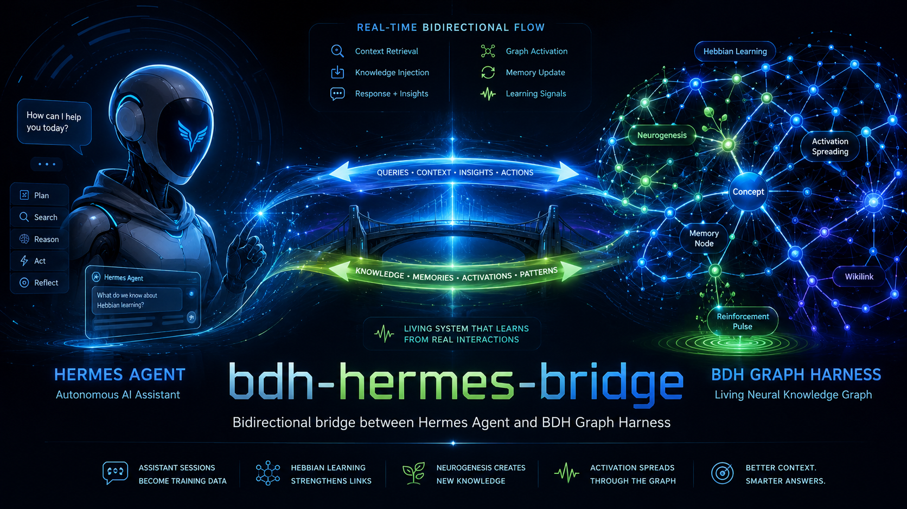

<p align="center">
  
</p>

# bdh-hermes-bridge

Bidirectional plugin bridge between [Hermes Agent](https://github.com/NousResearch/hermes-agent) and [BDH Graph Harness](https://github.com/albidev/bdh-graph-harness).

The plugin connects Hermes' real conversations to BDH's neural knowledge graph and exposes BDH context as native Hermes tools. It learns from actual usage — not fabricated bridge queries.

> **Status:** standalone Hermes plugin, version **0.8.0**.

## What it does

### Automatic read path — BDH → Hermes

At `pre_llm_call`, the bridge captures the original user message and applies a conservative eligibility gate. It automatically retrieves context for substantive knowledge messages — for example debugging, architecture, configuration, project questions, decisions, or references to earlier context. Casual messages such as “ciao”, “grazie”, and “ok” are skipped.

When `BDH_QUERY_REWRITE_ENABLED=true`, the bridge first asks a small LLM to classify and optionally rewrite the message. The **read path** uses `search_query` (an optimized/English/keyword form when helpful); the **write path** uses the canonical user-language `query`. Retrieval and storage are independent decisions: a turn can be `retrieve_only`, `store_only`, `retrieve_and_store`, or `skip`.

Automatic retrieval sends:

```json
{
  "query": "optimized search_query or original message",
  "source": "automatic_retrieval",
  "learn": false,
  "respond": false
}
```

`learn: false` makes this a read-only retrieval: no Hebbian reinforcement and no neurogenesis. The result is returned from `pre_llm_call` as ephemeral context injected into the current user message:

```text
[BDH CONTEXT — optional]
Activated neurons:
- ...

Relevant graph synthesis:
...

Use this as supporting context.
Do not mention BDH unless relevant.
If it conflicts with the current conversation, prefer the current conversation.
[/BDH CONTEXT]
```

The original user message remains the primary signal. BDH context supports it; it never replaces it. If BDH is unavailable, the hook returns no context and Hermes continues with its normal prompt after a short bounded timeout.

Automatic retrieval uses the vault's Hybrid index: Chroma cosine KNN plus BM25 lexical scoring. BDH exposes raw routing metadata (`vector_top_score`, `bm25_top_score`, `bm25_matched_terms`, `hybrid_top_score`, and `hybrid_margin`) before graph expansion. The bridge injects context when there are at least two lexical term matches or a strong semantic vector score. This is experimental routing logic; it does not modify Hebbian state.

### Query classification + rewrite pipeline (v0.8.0, opt-in)

When `BDH_QUERY_REWRITE_ENABLED=true`, the bridge adds an LLM-based preprocessing step before BDH retrieval. A single LLM call combines **routing** (`should_retrieve` and `store_candidate`), **rewrite** (`query` in the user's language), and an optional **search query** (`search_query`) that can be tuned for a specific vault.

**Why:** colloquial messages are often poor embedding seeds. The rewrite step converts them into concise, search-oriented representations. The optional `search_query` lets the bridge adapt to vaults that are mostly English even when the user speaks another language. Independent routing prevents transient operational noise from polluting the vault while still allowing a durable decision to be stored without performing a read.

**Routing contract (`schema_version: 2`):**

```json
{
  "schema_version": 2,
  "should_retrieve": true,
  "store_candidate": true,
  "query": "canonical user-language intent",
  "search_query": "optional retrieval-only query",
  "sub_queries": [],
  "knowledge_types": ["decision"],
  "confidence": 0.0
}
```

- **Read** (`pre_llm_call` automatic retrieval): only when `should_retrieve=true`; uses `search_query` if provided, otherwise `query`.
- **Write** (`post_api_request` learning): only when `store_candidate=true`; uses `query`, never retrieval-only variants.
- **Compatibility:** legacy `should_query` payloads are accepted and map to both flags, but new providers must emit schema v2.
- **Safety:** malformed v2 booleans are rejected; values such as the string `"false"` never fail open to `true`.

**The graph is domain-agnostic:** the classification prompt describes the vault as storing concepts, decisions, architecture choices, project context, lessons learned, strategies, and factual knowledge — not limited to technical content.

**Context recovery:** Hermes passes `conversation_history` in the `pre_llm_call` hook kwargs. The bridge extracts the last N messages (default 6, configurable), truncates each to 200 chars, and feeds them to the rewrite LLM. No state.db access needed.

**Fallback:** if the rewrite LLM times out, returns invalid JSON, or is unreachable, the bridge falls back to the mechanical gate + raw user message (v0.4.0 behavior). The pipeline is an enhancement, never a blocker. When a valid v2 response is available, retrieval and storage follow their independent flags.

**Write path consistency:** the user-language `query` is stored and reused as the embedding seed in `post_api_request`. This ensures the write signal reflects real user intent.

**Custom prompt override:** the default prompt is embedded, but you can point to an external Markdown file with `BDH_REWRITE_PROMPT_FILE`. The file is reloaded on every call, so edits take effect without a plugin restart. The default output schema still applies:

```json
{"schema_version": 2, "should_retrieve": true|false, "store_candidate": true|false, "query": "...", "search_query": "...", "sub_queries": ["..."], "knowledge_types": [], "confidence": 0.0}
```

**Configuration:**

| Env var | Default | Purpose |
|---|---|---|
| `BDH_QUERY_REWRITE_ENABLED` | `false` | Feature flag (opt-in) |
| `BDH_REWRITE_MODEL` | `deepseek-v4-flash` | OpenAI-compatible model for classification + rewrite |
| `BDH_REWRITE_TIMEOUT` | `5` | LLM call timeout in seconds |
| `BDH_REWRITE_API_URL` | `https://ollama.com/v1` | OpenAI-compatible endpoint (OpenRouter: `https://openrouter.ai/api/v1`) |
| `BDH_REWRITE_API_KEY` | (from env) | Dedicated API key for the rewrite LLM |
| `BDH_REWRITE_HTTP_REFERER` | empty | Optional OpenRouter attribution header |
| `BDH_REWRITE_APP_TITLE` | `BDH Hermes Bridge` | Optional OpenRouter application title |
| `BDH_REWRITE_PROMPT_FILE` | empty | Path to custom Markdown prompt file |
| `BDH_CONTEXT_MESSAGES_N` | `6` | Number of conversation_history messages to include |
| `BDH_CONTEXT_MSG_MAX_CHARS` | `200` | Max chars per context message |
| `BDH_REWRITE_MAX_VARIANTS` | `10` (v2 cap: `3`) | Legacy/provider variant bound; v2 never sends more than 3 retrieval variants |
| `BDH_SESSION_SYNTH_ENABLED` | `false` | Opt-in for cross-session synthesis on Hermes session finalization/reset |
| `BDH_SESSION_SYNTH_MIN_TURNS` | `3` | Minimum written turns before a session is worth synthesising |
| `BDH_SESSION_SYNTH_MAX_CHARS` | `6000` | Max characters of transcript fed to the synthesis LLM |

**Default classification prompt:**

```text
You are a query router for a personal knowledge graph.
The graph stores: concepts, decisions, architecture choices,
project context, lessons learned, strategies, and factual
knowledge about the user's projects and workflow. It does NOT
store operational commands, system diagnostics, or transient
task status.

Given the current user message and recent conversation context, decide:
1. Does this message require knowledge retrieval from the graph?
2. Does this interaction contain a durable knowledge candidate worth storing?
3. If retrieval is useful, rewrite the query as a clear, search-friendly query.
4. Generate at most three sub-queries only for genuinely independent topics.
5. Use context only to resolve references and omitted subjects. Never invent facts.
6. Keep `search_query` retrieval-only and `query` as the canonical user-language intent.

Reply as JSON only:
{"schema_version": 2, "should_retrieve": true|false, "store_candidate": true|false, "query": "...", "search_query": "...", "sub_queries": ["..."], "knowledge_types": [], "confidence": 0.0}
```

### Cron isolation — deny by default

Hermes passes scheduled-agent calls to plugins with `platform="cron"`. The bridge treats this as an isolation boundary:

- cron jobs do **not** use automatic BDH retrieval;
- cron responses do **not** enter the asynchronous BDH write/neurogenesis path;
- the policy is enforced at both `pre_llm_call` and `post_api_request`, so it does not depend on prompt wording or the job's loaded skills;
- an agent cron may opt in explicitly by placing `[BDH:ALLOW-CRON]` in its own prompt.

The opt-in is intentionally visible and per-job. The default for operational, news, social, watchdog, and maintenance crons is no BDH traffic. The dedicated `no_agent` BDH consolidation script remains independent from this bridge policy.

#### Prompt blacklist

Operational prompts that should not become graph knowledge can be excluded through `prompt_blacklist.txt` in the plugin directory. The file is read at hook time, so edits take effect without a restart:

```text
# Case-insensitive literal substring, comments and blank lines ignored
Review the conversation above and update the skill library.

# Optional regular expression
re:^nightly consolidation prompt:
```

A blacklisted prompt skips both automatic read retrieval and the asynchronous write/neurogenesis path. Set `BDH_PROMPT_BLACKLIST_FILE` to use a different file. This filter applies to bridge hooks; an explicit `bdh_query` tool call remains intentional and is not silently blocked.

### Automatic write path — Hermes → BDH

The plugin registers `pre_llm_call` to capture the current user message and `post_api_request` to inspect each API response. Only a substantial final response is sent back to BDH:

- `finish_reason == "stop"`
- assistant content is at least **200 characters**
- assistant content is non-empty
- a user message was captured by `pre_llm_call`

The request is sent in a daemon thread, so BDH learning does not block the agent response.

Payload:

```json
{
  "query": "the original user message",
  "user_prompt": "the assistant response",
  "source": "assistant_response"
}
```

The user message is deliberately used as the embedding/retrieval seed. The assistant response is supplied as context for BDH's LLM and neurogenesis stages. This avoids embedding Hermes' own answer as the primary signal and reduces feedback amplification.

When `source` is `assistant_response`, BDH applies dampened Hebbian learning (`frequency += 0.3` instead of the normal `1.0`). Neurogenesis still runs when BDH identifies a genuinely new concept.

### On-demand read path — BDH → Hermes

The plugin also registers two tools in the `bdh` toolset:

| Tool | Purpose |
|---|---|
| `bdh_query` | Perform a deeper, intentional graph query during reasoning. Uses normal Hebbian learning (`frequency += 1.0`). |
| `bdh_stats` | Return current graph metrics without querying the graph or triggering learning. |

Automatic retrieval provides lightweight initial context; `bdh_query` remains available when the model needs a targeted follow-up.

Example tool input:

```json
{
  "query": "How did we recover the Hermes session database?"
}
```

The tool returns a compact JSON result containing:

- up to 10 activated notes with scores
- BDH's generated response
- newly created concepts
- Hebbian update count
- neuron and synapse counts

## Echo-loop prevention

Without safeguards, a graph-backed agent can create this loop:

```text
BDH context → Hermes response → BDH indexes the response → same context is reinforced
```

This plugin prevents that in three ways:

1. The original user message is the primary `query`/embedding seed.
2. The assistant response is passed separately as `user_prompt`.
3. Assistant-originated writes use `source: "assistant_response"`, enabling dampened Hebbian updates on the server.

If no user message was captured, the write is skipped entirely. Embedding an orphaned assistant response would be exactly the sort of clever nonsense that makes a graph worse.

## Resilience and timeouts

BDH requests are made through a small HTTP helper with configurable base URL and bounded timeouts.

| Path | Timeout | Attempts | Timeout retry |
|---|---:|---:|---|
| Rewrite LLM (classify + rewrite) | 5s | 1 | N/A — falls back to mechanical gate |
| Automatic read hook | 2s | 1 | N/A |
| Automatic write hook | 30s | 2 total | No |
| `bdh_query` tool | 30s | 2 total | No |
| `bdh_stats` tool | 5s | 1 | N/A |

The POST `/api/query` endpoint is non-idempotent: BDH may have processed a request even if the client timed out. Therefore timeout errors are not retried, preventing duplicate Hebbian updates and duplicate neurogenesis.

If BDH is unreachable:

- the automatic hook logs a warning and Hermes continues normally;
- `bdh_query` returns an actionable JSON error telling Hermes to answer from internal knowledge;
- `bdh_stats` returns a JSON error instead of crashing the agent loop.

Other transient request failures can use the bounded retry path with exponential backoff. The current implementation is intentionally short and conservative rather than retrying for minutes while the agent waits.

## Architecture

```text
User message + conversation_history
     │
     ▼
pre_llm_call
     │ captures user_message
     │
     ├─ [if BDH_QUERY_REWRITE_ENABLED] ─────────────────────┐
     │   extract context from conversation_history           │
     │   LLM classify + rewrite (OpenAI-compatible, 5s)      │
     │   should_retrieve=false → skip read                    │
     │   store_candidate=false → skip write                   │
     │   should_retrieve=true  → rewritten retrieval query    │
     │   LLM failure → fallback to mechanical gate + raw     │
     │ ──────────────────────────────────────────────────────┘
     │
     ▼
BDH /api/query (read-only, learn=false)
     │
     ├── hybrid retrieval (Chroma KNN + BM25)
     ├── relevance gate (hybrid ≥ 0.30)
     └── context injection [BDH CONTEXT]
     │
Hermes LLM ────────────────┐
     │                     │ may call bdh_query
     │ final response      │ source: hermes_tool
     ▼                     │
post_api_request           │
     │                     │
     │ if stop + >200 chars│
     │ classification=false → skip write
     │ source: assistant_response
     ▼                     │
BDH /api/query ◄───────────┘
     │
     ├── retrieval / activation
     ├── dampened Hebbian update (0.3)
     ├── quality propagation
     └── neurogenesis when justified
```

## Requirements

- Hermes Agent with plugin support
- Hermes running in a gateway-managed/plugin-enabled process
- BDH Graph Harness running and exposing its HTTP API
- Default BDH endpoint: `http://localhost:8643`

The endpoint can be overridden with:

```bash
export BDH_API_URL="http://127.0.0.1:8643"
```

## Installation

### Clone into the Hermes plugin directory

```bash
git clone https://github.com/albidev/bdh-hermes-bridge.git ~/.hermes/plugins/bdh-hermes-bridge
```

### Or use a development symlink

```bash
git clone https://github.com/albidev/bdh-hermes-bridge.git ~/Projects/bdh-hermes-bridge
ln -s ~/Projects/bdh-hermes-bridge ~/.hermes/plugins/bdh-hermes-bridge
```

Enable it in `~/.hermes/config.yaml`:

```yaml
plugins:
  enabled:
    - bdh-hermes-bridge
```

Restart the gateway after changing the plugin code or configuration:

```bash
hermes gateway restart
```

Plugins are loaded at process startup. Editing `__init__.py` without restarting leaves the running gateway on the old implementation — a classic way to debug code that is not actually running.

## Plugin manifest

`plugin.yaml` declares:

```yaml
name: bdh-hermes-bridge
version: 0.8.0
kind: standalone
provides_hooks:
  - pre_llm_call
  - post_api_request
  - post_tool_call
  - transform_llm_output
provides_tools:
  - bdh_query
  - bdh_stats
```

The hooks and tools are registered explicitly in `register(ctx)`.

## BDH API contract

The plugin uses these endpoints:

### `POST /api/query`

Required field:

- `query` — query or embedding seed

Optional fields:

- `user_prompt` — additional LLM/neurogenesis context
- `source` — `assistant_response` for dampened learning, `hermes_tool` for normal tool-driven learning

### `GET /api/stats`

Returns graph metrics including neurons, active/dormant neurons, synapses, Hebbian synapses, average degree, and processed query count.

## Verification

Check plugin discovery and enabled status:

```bash
hermes plugins list --plain --no-bundled
```

Check the plugin files:

```bash
ls -la ~/.hermes/plugins/bdh-hermes-bridge/
```

Verify BDH is reachable:

```bash
curl -sS http://localhost:8643/api/stats
```

Check registration and runtime activity in Hermes logs:

```bash
search="bdh-bridge"
rg "$search" ~/.hermes/logs/agent.log ~/.hermes/logs/errors.log
```

A successful load logs:

```text
[bdh-bridge] registered: hooks=[pre_llm_call, post_api_request], tools=[bdh_query, bdh_stats], api=http://localhost:8643
```

## Operational notes

- The plugin does not invent queries to manufacture neurogenesis.
- `bdh_stats` is read-only from the plugin's perspective.
- `bdh_query` is synchronous because Hermes needs its result before continuing; use it selectively.
- Automatic writes are asynchronous and do not alter the assistant response.
- BDH may be temporarily unavailable during consolidation; this is handled as a soft failure.
- The plugin catches hook exceptions so a BDH problem does not take down Hermes.

## License

MIT
